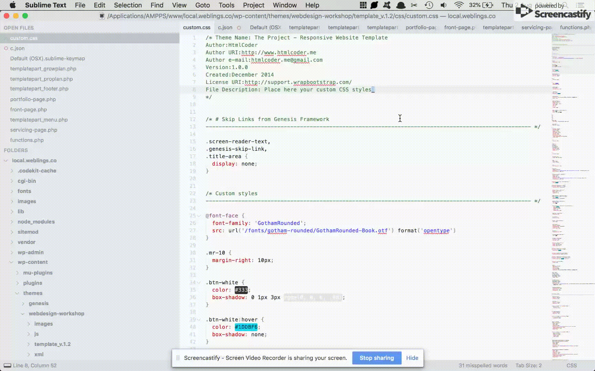

# CommentFold
A Sublime Text plugin to give an overview of your comments by folding all other code.



# Default key binding
fold: "ctrl+alt+/"
unfold: "shift+ctrl+alt+/"

Feel free to override these in Sublime Text -> Preferences -> Key Bindings by adding the following lines and change as preferred:

```
{
    "keys": ["ctrl+alt+/"],
    "command": "comment_fold"
	},
{
    "keys": ["shift+ctrl+alt+/"],
    "command": "comment_unfold"
	}
```
